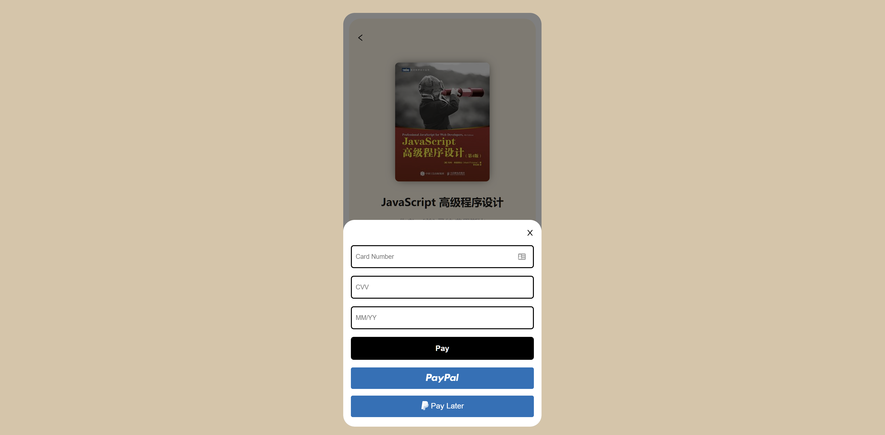
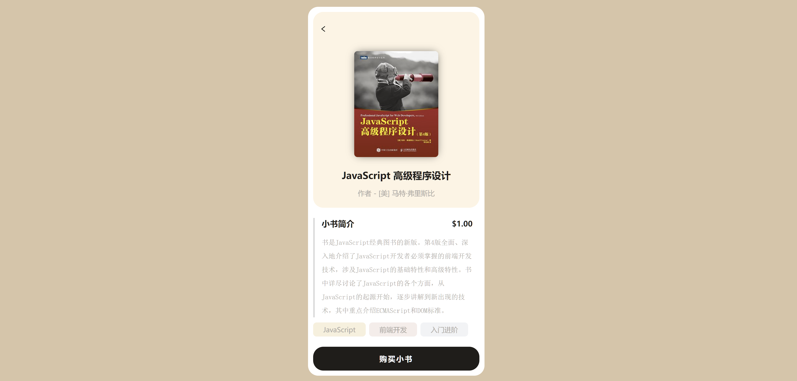

# ebook-paypal-payment

一个用 PalPal 支付电子书的 Demo。



## 使用

创建 `./server/.env`，并添加 PayPal 提供的沙盒信息：

```shell
CLIENT_ID=你的 Client Id
CLIENT_SECRET=你的 Client Secret
```

开启 server 端，打开 `http://localhost:3001/`：

```shell
cd ./server

npm install

npm run dev
```

开启 client 端，开启 `http://localhost:5173/`：

```shell
cd ./client

npm install

npm run dev
```

将在 `http://localhost:5173/` 看到效果



## 技术

* client
  * react
  * paypal-react-js
* server
  * koa
  * axios

## 参考

* UI: https://dribbble.com/shots/14930553/attachments/6646396?mode=media
* YouTube: https://www.youtube.com/watch?v=zIuiB5qdbgQ
